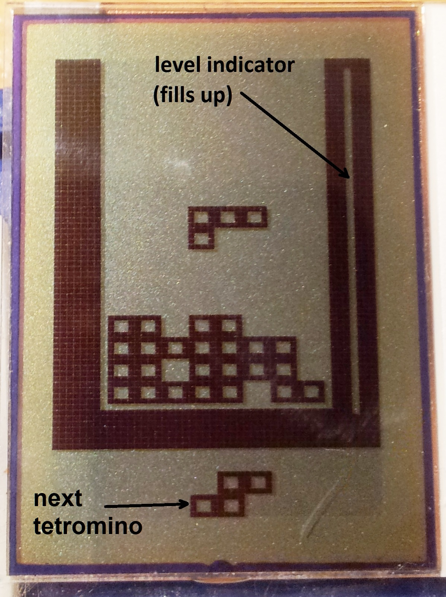
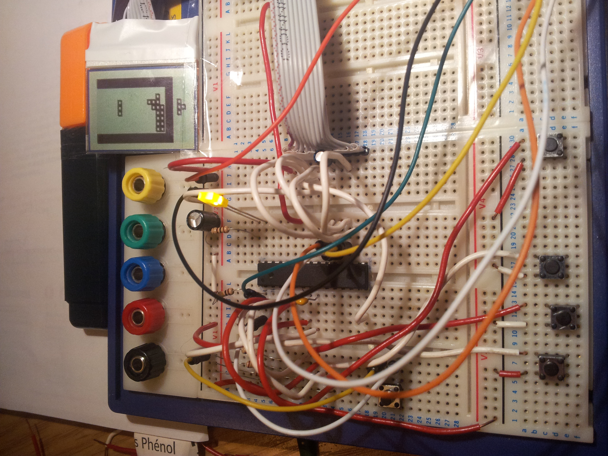

# Tetris-like game on ATmega8 with Nokia 3310 Display

Welcome to the Tetris project for the ATmega8 microcontroller! This repository contains the source code for a minimalist Tetris game that runs on the ATmega8, using a Nokia 3310 LCD display. This project took a part in the [1KB Challenge](https://hackaday.io/contest/18215-the-1kb-challenge) contest on Hackaday.io, where developers try to implement creative solutions within a strict memory limit.

Contestant page: [https://hackaday.io/project/19272-atmega-tetris](https://hackaday.io/project/19272-atmega-tetris)

## Overview

Tetris is a classic puzzle game where players rotate and place falling tetrominoes to complete lines. In this implementation, we have created a compact version of Tetris that fits into a small footprint, designed specifically for the ATmega8 microcontroller.
There were many optimizations applied to the C code to reach the 1024B binary size limit.

### Features

- **Gameplay**: Classic Tetris mechanics with tetromino rotation and line clearing.
- **Display**: Utilizes the Nokia 3310 LCD for graphics output.
- **Progress display**: Displayed as a vertical bar filling from the bottom (easy) to the top (hard) during the game play.
- **Memory Efficiency**: Implemented with strict attention to code size; fits within the 1KB constraint.
- **Controls**: Simple button controls to rotate and move tetrominoes.
- **Limits**: Limited tetrominoes (not fully meeting the classic Tetris standard) due to game size optimization.

## Getting Started

### Requirements

- **Hardware**:
  - ATmega8 microcontroller
  - Nokia 3310 LCD module
  - Breadboard with connection wires
  - Basic electronic components (resistors, capacitors, buttons)
  - 5V DC power source
  
- **Software**:
  - Atmel Studio IDE to build the sources
  - Your favourite AVR ISP flashing tool (AVRdude or similar)

## License

This project is released under the GPL License.

## Acknowledgments

Inspiration from the classic Tetris game.
Hackaday.io for hosting the 1KB Challenge and fostering creativity in embedded systems.
